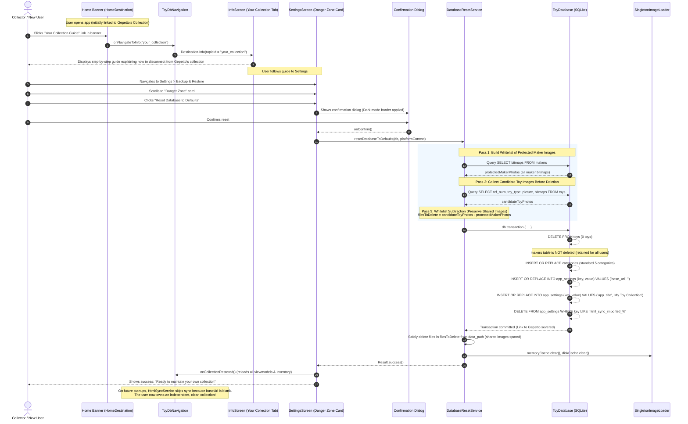
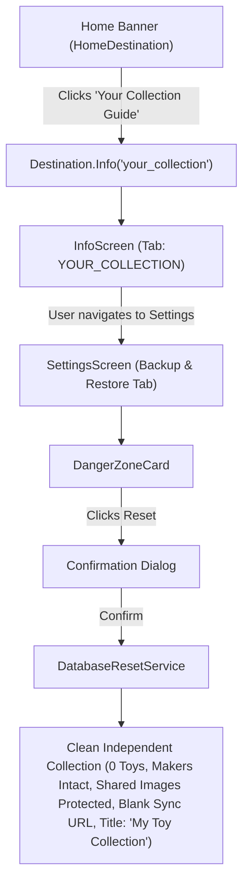

# Toy Collection: Reset Database to Defaults Implementation Plan

**Target Document**:
- `~/valdetaro/ToyCollection/.agents/RESET_DB_PLAN.md` (Canonical Plan)

**Document Version**: 1.4.0  
**Target Project**: `~/valdetaro/ToyCollection` (`composeApp`)  
**Target Platforms**: Desktop (macOS, Windows), Android, WebAssembly (WasmJs)  
**Document Nature**: **LIVE DOCUMENT** — Maintain and update this document during execution. Any agent executing, modifying, or encountering issues with this feature must update Section 5 (Checklist), Section 7 (Change Log), and Section 8 (Bug Tracker).

---

## 1. Executive Summary & Objective

### 1.1 Problem Statement & Background
1. **The App Starts as a Connected Viewer of Gepetto's Collection**:
   - Out of the box, **Gepetto's Toy Database Manager (Toy Collection)** is packaged and configured with a direct link to Gepetto's personal collection:
     - The packaged SQLite database contains default categories and 198 manufacturers (`makers`).
     - The web synchronization setting `base_url` is configured by default to point to **`https://gepetto.club/database/`**.
     - On launch, [`ToyDbNavigation.kt`](file:///Users/luizvaldetaro/valdetaro/ToyCollection/composeApp/src/commonMain/kotlin/com/gepetto/toydb/ui/ToyDbNavigation.kt) executes [`HtmlSyncService.syncIfNewer()`](file:///Users/luizvaldetaro/valdetaro/ToyCollection/composeApp/src/commonMain/kotlin/com/gepetto/toydb/service/HtmlSyncService.kt). If the local toys table has 0 records, `HtmlSyncService` explicitly forces an automated download of Gepetto's entire collection (1,600+ toys) from `https://gepetto.club/database/`!
     - In addition, on-demand image loading ([`SyncImage.kt`](file:///Users/luizvaldetaro/valdetaro/ToyCollection/composeApp/src/commonMain/kotlin/com/gepetto/toydb/ui/SyncImage.kt)) downloads missing photos directly from Gepetto's server using this `base_url`.
2. **The Main Goal: Transitioning from Gepetto's Collection to the User's Own Collection**:
   - The primary objective of this entire feature is **to allow a new user to disconnect from Gepetto's collection and create and maintain their own personal collection**.
   - Simply deleting toys is insufficient: because `base_url` defaults to `https://gepetto.club/database/`, `HtmlSyncService` would detect 0 toys and immediately re-download Gepetto's collection on the next startup!
   - Therefore, the transition requires a coordinated operation:
     1. Severing the link to Gepetto's collection by **wiping out the web synchronization URL (`base_url`)**.
     2. Deleting all of Gepetto's toy records (`DELETE FROM toys`).
     3. **Preserving the Manufacturers (`makers`) Table**: The manufacturers directory is a universal, comprehensive reference of 198 makers (with countries and historical details) that is valuable for every collector. **The `makers` table is NOT deleted.**
     4. **Shared Image Protection**: Toys sometimes reference the same image files as manufacturers (e.g. maker logos, factory pictures). Any image referenced by a manufacturer must **NEVER be deleted**, even if it was also referenced by a deleted toy.
     5. Purging only toy-specific photos from the local `data` directory while **keeping all maker photos strictly protected**.
     6. Updating the collection title to **"My Toy Collection"**.
     7. Educating the user through a dedicated **"Danger Zone"** card in Settings, a step-by-step **"Your Collection"** guide tab in Info, and a prominent banner link on the Home screen.

### 1.2 User Directives & Core Requirements
The user provided the following explicit instructions for this feature:
1. **Primary Goal**: Allow a new user to create and maintain their own collection instead of viewing Gepetto's collection.
2. **Clean Reset Scope**: The reset wipes all toys (0 toys) and ensures standard categories are present.
3. **DO NOT DELETE MAKERS**: The `makers` table must be **kept completely intact**. It is useful to all collectors.
4. **Photos Handling & Shared Image Protection**: Keep only photos related to makers (`makers.bitmaps`). Toys sometimes use the same image files as makers—**do not delete those shared image files**. Purge only toy-specific photos from local storage.
5. **Collection Title**: Reset the application/collection title to **"My Toy Collection"**.
6. **Dedicated "Danger Zone" Card**: The reset action must be placed in its own dedicated card named **"Danger Zone"** inside the **Backup & Restore** tab in Settings.
7. **Card Educational Copy**: The card must explicitly explain that by default the app shows Gepetto's Collection; if the user wants to maintain **their own** collection, they should use this button.
8. **No Auto-Backup**: Do **not** create an automatic safety backup archive before wiping.
9. **Wipe Remote Sync URL**: When wiping the database, the URL for web syncing (`base_url`) must be completely wiped out (cleared to empty), and sync import timestamps must be purged, cutting off any remote synchronization with Gepetto's server.
10. **New User Guide Info Tab ("Your Collection")**: Create a dedicated tab in the Info screen (`InfoScreen.kt`) instructing a new user step-by-step on how to switch from Gepetto's collection to their own collection.
11. **Main Screen Banner Link**: Place a quick, clear sentence on the main screen banner (`HomeDestination.kt`) with an interactive link taking the user directly to the new "Your Collection" Info tab.
12. **Living Document**: This plan must be stored in `.agents/` of the app (`ToyCollection/.agents/RESET_DB_PLAN.md`), written with sufficient detail for any agent to execute, and maintained with a live change log and bug tracker.

---

## 2. Inviolable Directives for Executing Agents

> [!IMPORTANT]
> ### Directive 1: Sever the Remote Sync Link (`base_url` Wipeout)
> In [`HtmlSyncService.kt`](file:///Users/luizvaldetaro/valdetaro/ToyCollection/composeApp/src/commonMain/kotlin/com/gepetto/toydb/service/HtmlSyncService.kt) line 184:  
> `if (!hasToys) { GcLog.d(TAG, "Local toys table is empty. Forcing web synchronization."); isNewer = true; }`  
> If `base_url` is not wiped out to an empty string (`""`), `HtmlSyncService` will re-download Gepetto's collection every time the user starts the app with an empty toys table!  
> In [`ToyRepository.kt`](file:///Users/luizvaldetaro/valdetaro/ToyCollection/composeApp/src/commonMain/kotlin/com/gepetto/toydb/database/ToyRepository.kt), `getBaseUrlSetting()` must return `""` when `base_url` is stored as `""`, rather than falling back to `https://gepetto.club/database/`. This permanently stops background sync and remote photo downloading from Gepetto's server.

> [!IMPORTANT]
> ### Directive 2: Do Not Touch the Makers Table
> Do NOT execute `DELETE FROM makers` or overwrite the `makers` table. Retain all existing makers, countries, logos, and manufacturer bitmaps.

> [!IMPORTANT]
> ### Directive 3: Shared Image Protection & Whitelist Subtraction
> **Toys sometimes use the same image files as manufacturers (e.g. maker logos, factory images).**  
> Never delete any image referenced by a maker, even if it is also attached to a deleted toy!  
> The file deletion algorithm must strictly use whitelist subtraction:
> 1. Build the protected maker photos whitelist: query `SELECT bitmaps FROM makers` and collect all filenames and base names.
> 2. Query candidate toy photos from `toys` (primary picture, secondary bitmaps, and `${prefix}${refNum}.*`).
> 3. Compute `filesToDelete = candidateToyPhotos - protectedMakerPhotos`.
> 4. Delete only files in `filesToDelete`. Any shared image is strictly protected and never touched.

> [!IMPORTANT]
> ### Directive 4: Atomic In-Transaction Reset (No Raw File Deletion)
> Never delete or overwrite the active SQLite file (`toydb.db`) while the application is running. On Windows and macOS, open JDBC connection handles will lock the file or crash active queries. Execute all reset operations inside an atomic transaction (`db.transaction { ... }`) holding `CollectionWriteLock`. If any step fails, the transaction rolls back cleanly.

> [!IMPORTANT]
> ### Directive 5: Dark Mode Dialog Borders
> According to `.agents/AGENTS.md` (UI Standards, Rule 15): **"Every Dialog, when in dark mode, must have a border."**  
> The confirmation dialog in `DangerZoneCard` must apply a visible border (e.g., `BorderStroke(1.dp, MaterialTheme.colorScheme.outline)`) when `isSystemInDarkTheme()` is true.

> [!IMPORTANT]
> ### Directive 6: Pure Kotlin Multiplatform (KMP) Compatibility
> All common business logic in `commonMain` must remain 100% free of platform-specific JVM/Android dependencies (`java.io`, `android.util.Log`). Use `okio.Path`, `toydb.composeapp.generated.resources.Res`, and `club.gepetto.GcLog`.

> [!IMPORTANT]
> ### Directive 7: Full Multilingual Support & ASD-STE100 Technical Writing
> All new user-facing strings and markdown documents must be defined as resources and localized across all 6 supported languages:
> - English (`values/strings.xml`, `files/en_*.md`) — must strictly follow **ASD-STE100 Simplified Technical English**
> - German (`values-de/strings.xml`, `files/de_*.md`)
> - Spanish (`values-es/strings.xml`, `files/es_*.md`)
> - French (`values-fr/strings.xml`, `files/fr_*.md`)
> - Italian (`values-it/strings.xml`, `files/it_*.md`)
> - Portuguese (`values-pt/strings.xml`, `files/pt_*.md`)

> [!IMPORTANT]
> ### Directive 8: Git Hygiene
> NEVER commit or push to Git without an explicit direct order from the user (`.agents/AGENTS.md` Rule 1). Keep all changes in the working tree for user review.

> [!IMPORTANT]
> ### Directive 9: Live Document Maintenance
> Any executing agent must record completion checkboxes in Section 5, architectural changes in Section 7, and any unexpected behavior or bugs in Section 8.

---

## 3. Architecture & Data Flow

### 3.1 End-to-End Onboarding & Reset Workflow



### 3.2 UI Navigation Routing



### 3.3 Database & Storage State Transition Matrix

| Table / Setting / Asset | Before Reset (Gepetto's State or Modified) | After Reset (User's Personal Collection) |
| :--- | :--- | :--- |
| `toys` | Gepetto's toys ($N \ge 0$) | **0 records** (`DELETE FROM toys`) |
| `makers` | Existing makers | **KEPT INTACT** (no records deleted) |
| `category_settings` | Current categories | **Standard 5 categories** (`slot`, `train`, `static`, `kit`, `misc`) |
| `app_settings.base_url` | `"https://gepetto.club/database/"` | **`""` (Empty string)** — remote sync with Gepetto permanently disabled |
| `app_settings.app_title` | `"Gepetto Toy Database Manager"` | **`"My Toy Collection"`** |
| `app_settings.html_sync_*` | Stored sync hashes and timestamps | **Deleted** (`WHERE key LIKE 'html_sync_imported_%'`) |
| `app_settings.data_path` | Local directory path (e.g. photos) | **Preserved intact** (keeps user's photo storage configuration) |
| `app_settings.theme` | Current theme (`0`, `1`, `2`) | **Preserved intact** |
| `app_settings.language` | Current language selection | **Preserved intact** |
| Maker Photos in `data_path` | Photos referenced by `makers.bitmaps` | **PRESERVED INTACT** |
| Shared Photos (Used by both toy and maker) | Photos referenced in both `toys` and `makers` | **PRESERVED INTACT (NEVER DELETED)** |
| Toy-Only Photos in `data_path` | Photos referenced only by deleted toys | **Purged from disk** to reclaim space |

---

## 4. Component-by-Component Specifications

### 4.1 Bundled Resources (`composeResources`)
- Copy `ToyCollection/json/category_settings.json` to `composeApp/src/commonMain/composeResources/files/category_settings.json`.
- Copy `ToyCollection/json/carmaker.json` to `composeApp/src/commonMain/composeResources/files/carmaker.json`.
- Standard categories can be verified and ensured using `ImportExportService.importCategorySettings`.

### 4.2 Repository Layer: Base URL & App Title Handling
**Target File**: [`composeApp/src/commonMain/kotlin/com/gepetto/toydb/database/ToyRepository.kt`](file:///Users/luizvaldetaro/valdetaro/ToyCollection/composeApp/src/commonMain/kotlin/com/gepetto/toydb/database/ToyRepository.kt)

**Base URL Adjustment**:
```kotlin
fun getBaseUrlSetting(): String {
    val setting = getAppSetting("base_url") ?: return getDefaultBaseUrlSetting()
    if (com.gepetto.toydb.utils.isWebPlatform() && setting == "https://gepetto.club/database/") {
        return getDefaultBaseUrlSetting()
    }
    return setting
}
```

### 4.3 Service Layer: `DatabaseResetService`
**Target File**: `composeApp/src/commonMain/kotlin/com/gepetto/toydb/service/DatabaseResetService.kt` (New File)

**Responsibilities**:
1. Acquire `CollectionWriteLock.mutex.withLock`.
2. **Collect Protected Maker Photos**:
   ```kotlin
   val protectedMakerPhotos = mutableSetOf<String>()
   val makerCursor = db.query("SELECT bitmaps FROM makers")
   while (makerCursor.next()) {
       val bitmaps = makerCursor.getString("bitmaps") ?: ""
       bitmaps.split(' ').filter { it.isNotBlank() }.forEach {
           val trimmed = it.trim().lowercase()
           protectedMakerPhotos.add(trimmed)
           val withoutExt = trimmed.substringBeforeLast('.')
           if (withoutExt.isNotEmpty()) protectedMakerPhotos.add(withoutExt)
       }
   }
   makerCursor.close()
   ```
3. **Collect Candidate Toy Photos Before Deletion**:
   ```kotlin
   val candidateToyPhotos = mutableSetOf<String>()
   val extensions = listOf("jpg", "jpeg", "png", "gif", "webp")
   val toyCursor = db.query("SELECT ref_num, toy_type, picture, bitmaps FROM toys")
   while (toyCursor.next()) {
       val refNum = toyCursor.getInt("ref_num") ?: 0
       val toyType = toyCursor.getString("toy_type") ?: ""
       val picture = toyCursor.getString("picture")?.trim() ?: ""
       val bitmaps = toyCursor.getString("bitmaps")?.trim() ?: ""
       if (picture.isNotEmpty()) candidateToyPhotos.add(picture.lowercase())
       bitmaps.split(' ').filter { it.isNotBlank() }.forEach { candidateToyPhotos.add(it.trim().lowercase()) }
       val prefix = categoryPrefixMap[toyType] ?: "car"
       for (ext in extensions) {
           candidateToyPhotos.add("${prefix}${refNum}.$ext".lowercase())
       }
   }
   toyCursor.close()
   ```
4. **Compute Safe Whitelist Subtraction**:
   ```kotlin
   val filesToDelete = candidateToyPhotos.filter {
       it !in protectedMakerPhotos && it.substringBeforeLast('.') !in protectedMakerPhotos
   }
   ```
5. **Execute In-Transaction Reset**:
   ```kotlin
   db.transaction {
       db.execute("DELETE FROM toys")
       ImportExportService.importCategorySettings(db, categorySettingsJson)
       // makers table is NOT deleted
       db.execute("INSERT OR REPLACE INTO app_settings (key, value) VALUES ('base_url', '')")
       db.execute("INSERT OR REPLACE INTO app_settings (key, value) VALUES ('app_title', 'My Toy Collection')")
       db.execute("DELETE FROM app_settings WHERE key LIKE 'html_sync_imported_%'")
   }
   ```
6. **Purge Only Safe Toy Files from `data_path`**:
   - For each file in `filesToDelete`: if it exists in `data_path`, delete it safely.
   - Any file shared between a toy and a maker is spared!
7. Evict Coil image caches (`SingletonImageLoader.get(context).memoryCache?.clear()`, `diskCache?.clear()`).
8. Log all actions with `GcLog.i("DatabaseResetService", ...)`.

### 4.4 UI Layer: `DangerZoneCard` & `SettingsScreen`
**Target File**: `composeApp/src/commonMain/kotlin/com/gepetto/toydb/ui/DangerZoneCard.kt` (New File)

**Layout & Styling**:
- Container: Material 3 `OutlinedCard` with a subtle destructive border:
  `border = BorderStroke(1.dp, MaterialTheme.colorScheme.error.copy(alpha = 0.5f))`
- Header: Icon (`Icons.Default.Warning`) tinted with `MaterialTheme.colorScheme.error`, title **"Danger Zone"** (`danger_zone_title`).
- Informational Body:
  `Text(stringResource(Res.string.danger_zone_desc))`
  *Explanation text: "By default, this application displays Gepetto's Toy Collection. If you want to maintain your own personal collection, use this button to reset the database. This action deletes all toys, keeps all manufacturers, removes toy photos from your data directory, and disconnects the web synchronization URL."*
- Action Button:
  `Button` with `colors = ButtonDefaults.buttonColors(containerColor = MaterialTheme.colorScheme.error)`
  Label: `"Reset Database to Defaults"` (`danger_zone_reset_btn`)
- Confirmation Dialog:
  - Triggered on button click.
  - Border in dark mode: `if (isSystemInDarkTheme()) Modifier.border(1.dp, MaterialTheme.colorScheme.outline, RoundedCornerShape(16.dp)) else Modifier`.
  - Destructive Confirm button ("Reset Database") and Cancel button.
- Progress & Status:
  - While resetting: Circular progress indicator or disabled button state.
  - On complete: Snackbar or status message: `"Database reset complete. You can now maintain your own collection."`

**Integration**:
**Target File**: [`composeApp/src/commonMain/kotlin/com/gepetto/toydb/ui/SettingsScreen.kt`](file:///Users/luizvaldetaro/valdetaro/ToyCollection/composeApp/src/commonMain/kotlin/com/gepetto/toydb/ui/SettingsScreen.kt)
- Inside `SettingsTab.BACKUP_RESTORE`, place `DangerZoneCard` directly below `BackupRestoreCard`.
- Pass `onCollectionReset = { restoreKey++; onCollectionRestored() }`.

### 4.5 New User Guide Info Tab & Markdown Assets
**Target Files**:
- Code: [`composeApp/src/commonMain/kotlin/com/gepetto/toydb/ui/InfoScreen.kt`](file:///Users/luizvaldetaro/valdetaro/ToyCollection/composeApp/src/commonMain/kotlin/com/gepetto/toydb/ui/InfoScreen.kt)
- Markdown Resources (`composeApp/src/commonMain/composeResources/files/`):
  - `en_your_collection.md` (ASD-STE100)
  - `pt_your_collection.md`
  - `de_your_collection.md`
  - `es_your_collection.md`
  - `fr_your_collection.md`
  - `it_your_collection.md`

**InfoTopic Enum Addition**:
```kotlin
enum class InfoTopic(val id: String, val titleRes: StringResource) {
    ABOUT("about", Res.string.info_tab_about),
    YOUR_COLLECTION("your_collection", Res.string.info_tab_your_collection),
    GENERAL("general", Res.string.tab_general),
    BACKUP_RESTORE("backup_restore", Res.string.backup_title),
    SERVER_SYNC("server_sync", Res.string.info_tab_backup),
    CATEGORIES("categories", Res.string.categories),
    PRIVACY("privacy", Res.string.info_tab_privacy),
    TERMS("terms", Res.string.info_tab_terms)
}
```

**Markdown Structure & Content (ASD-STE100 compliant)**:
The guide must contain explicit step-by-step instructions:
1. **Introduction**: Explains that the app starts linked to Gepetto's toy collection.
2. **Step 1: Reset Database in Danger Zone**:
   - Go to **Settings** $\rightarrow$ **Backup & Restore** $\rightarrow$ **Danger Zone**.
   - Click **Reset Database to Defaults** and confirm.
   - *Result*: Deletes all toys, keeps all 198 manufacturers and their photos, resets the title to "My Toy Collection", and disconnects the web sync URL.
3. **Step 2: Configure Your Storage Directory** (`<!-- desktop -->`):
   - In **Settings** $\rightarrow$ **General**, select your local **Data Folder**.
4. **Step 3: Customize Categories and Manufacturers**:
   - All standard manufacturers are already preserved in your directory. You can add new ones or edit them anytime.
5. **Step 4: Add Your Toys**:
   - Go to **Dashboard** or any category and click **+** (Add Toy).
6. **Step 5: Create Backups Regularly**:
   - Save your `.zip` backups in **Settings** $\rightarrow$ **Backup & Restore**.

### 4.6 Main Screen Banner Integration
**Target Files**:
- [`composeApp/src/commonMain/kotlin/com/gepetto/toydb/ui/HomeDestination.kt`](file:///Users/luizvaldetaro/valdetaro/ToyCollection/composeApp/src/commonMain/kotlin/com/gepetto/toydb/ui/HomeDestination.kt)
- [`composeApp/src/commonMain/kotlin/com/gepetto/toydb/ui/ToyDbNavigation.kt`](file:///Users/luizvaldetaro/valdetaro/ToyCollection/composeApp/src/commonMain/kotlin/com/gepetto/toydb/ui/ToyDbNavigation.kt)

**Banner Text Update**:
```kotlin
// Build annotated banner string:
append(pSwitchPre) // "To switch from Gepetto's collection to your own collection, see the "
pushStringAnnotation(tag = "ACTION", annotation = "your_collection")
withStyle(SpanStyle(color = linkColor, textDecoration = TextDecoration.Underline, fontWeight = FontWeight.Bold)) {
    append(linkYourCollection) // "Your Collection Guide"
}
pop()
append(pSwitchPost) // "."
```
In `onClick` handler of `ClickableText`:
```kotlin
when (annotation.item) {
    "dashboard" -> onNavigateToDashboard()
    "info" -> onNavigateToInfo(null)
    "your_collection" -> onNavigateToInfo("your_collection")
}
```

### 4.7 Localization Resources (All 6 Languages)

| String Key | English (`values`) (ASD-STE100) | Portuguese (`values-pt`) | German (`values-de`) | Spanish (`values-es`) | French (`values-fr`) | Italian (`values-it`) |
| :--- | :--- | :--- | :--- | :--- | :--- | :--- |
| `danger_zone_title` | Danger Zone | Zona de Perigo | Gefahrenbereich | Zona de Peligro | Zone Dangereuse | Zona Pericolosa |
| `danger_zone_desc` | By default, this application displays Gepetto\'s Toy Collection. If you want to maintain your own collection, use this button to reset the database. This action deletes all toys, keeps all manufacturers, removes toy photos from your data directory, and disconnects the web synchronization URL. | Por padrão, este aplicativo exibe a Coleção de Brinquedos do Gepetto. Se você deseja manter sua própria coleção, use este botão para redefinir o banco de dados. Esta ação exclui todos os brinquedos, mantém todos os fabricantes, remove as fotos de brinquedos da sua pasta de dados e desconecta o URL de sincronização web. | Standardmäßig zeigt diese Anwendung Gepettos Spielzeugsammlung an. Wenn Sie Ihre eigene Sammlung verwalten möchten, verwenden Sie diese Schaltfläche, um die Datenbank zurückzusetzen. Diese Aktion löscht alle Spielzeuge, behält alle Hersteller bei, entfernt Spielzeugfotos aus Ihrem Datenordner und trennt die Web-Synchronisierungs-URL. | Por defecto, esta aplicación muestra la Colección de Juguetes de Gepetto. Si desea mantener su propia colección, use este botón para restablecer la base de datos. Esta acción elimina todos los juguetes, mantiene todos los fabricantes, elimina las fotos de juguetes de su carpeta de datos y desconecta la URL de sincronización web. | Par défaut, cette application affiche la Collection de Jouets de Gepetto. Si vous souhaitez gérer votre propre collection, utilisez ce bouton pour réinitialiser la base de données. Cette action supprime tous les jouets, conserve tous les fabricants, supprime les photos de jouets de votre dossier de données et déconnecte l\'URL de synchronisation web. | Per impostazione predefinita, questa applicazione mostra la Collezione di Giocattoli di Gepetto. Se desideri gestire la tua collezione personale, usa questo pulsante per reimpostare il database. Questa azione elimina tutti i giocattoli, conserva tutti i produttori, rimuove le foto dei giocattoli dalla cartella dati e disconnette l\'URL di sincronizzazione web. |
| `danger_zone_reset_btn` | Reset Database to Defaults | Redefinir Banco de Dados | Datenbank auf Standard zurücksetzen | Restablecer Base de Datos | Réinitialiser la Base de Données | Reimposta Database sui Predefiniti |
| `danger_zone_confirm_title` | Reset Collection to Defaults? | Redefinir Coleção para Padrões? | Sammlung auf Standard zurücksetzen? | ¿Restablecer Colección a Valores Iniciales? | Réinitialiser la Collection aux Valeurs par Défaut ? | Reimpostare la Collezione sui Predefiniti? |
| `danger_zone_confirm_msg` | This action will permanently delete all toys and disconnect the web synchronization URL. All manufacturers and their photos are kept. You cannot undo this action. | Esta ação excluirá permanentemente todos os brinquedos e desconectará o URL de sincronização web. Todos os fabricantes e suas fotos serão mantidos. Você não pode desfazer esta ação. | Diese Aktion löscht dauerhaft alle Spielzeuge und trennt die Web-Synchronisierungs-URL. Alle Hersteller und deren Fotos bleiben erhalten. Sie können diese Aktion nicht rückgängig machen. | Esta acción eliminará permanentemente todos los juguetes y desconectará la URL de sincronización web. Se conservarán todos los fabricantes y sus fotos. No puede deshacer esta acción. | Cette action supprimera définitivement tous les jouets et déconnectera l\'URL de synchronisation web. Tous les fabricants et leurs photos sont conservés. Vous ne pouvez pas annuler cette action. | Questa azione eliminerà definitivamente tutti i giocattoli e disconnetterà l\'URL di sincronizzazione web. Tutti i produttori e le loro foto vengono conservati. Non è possibile annullare questa azione. |
| `danger_zone_confirm_btn` | Reset Database | Redefinir Banco de Dados | Datenbank zurücksetzen | Restablecer Base de Datos | Réinitialiser | Reimposta Database |
| `danger_zone_resetting` | Resetting database to defaults... | Redefinindo banco de dados... | Datenbank wird zurückgesetzt... | Restableciendo base de datos... | Réinitialisation de la base de données... | Reimpostazione del database in corso... |
| `danger_zone_done` | Database reset complete. You can now maintain your own collection. | Redefinição concluída. Agora você pode gerenciar sua própria coleção. | Zurücksetzen abgeschlossen. Sie können nun Ihre eigene Sammlung verwalten. | Restablecimiento completado. Ahora puede administrar su propia colección. | Réinitialisation terminée. Vous pouvez maintenant gérer votre propre collection. | Reimpostazione completata. Ora puoi gestire la tua collezione. |
| `danger_zone_failed` | Failed to reset database: %1$s | Falha ao redefinir banco de dados: %1$s | Fehler beim Zurücksetzen der Datenbank: %1$s | Error al restablecer la base de datos: %1$s | Échec de la réinitialisation de la base de données: %1$s | Impossibile reimpostare il database: %1$s |
| `info_tab_your_collection` | Your Collection | Sua Coleção | Ihre Sammlung | Su Colección | Votre Collection | La Tua Collezione |
| `home_banner_switch_pre` | \n\n\tTo switch from Gepetto\'s collection to your own collection, see the | \n\n\tPara mudar da coleção do Gepetto para a sua própria coleção, consulte o | \n\n\tUm von Gepettos Sammlung zu Ihrer eigenen Sammlung zu wechseln, lesen Sie den | \n\n\tPara cambiar de la colección de Gepetto a su propia colección, consulte la | \n\n\tPour passer de la collection de Gepetto à votre propre collection, consultez le | \n\n\tPer passare dalla collezione di Gepetto alla tua collezione personale, consulta la |
| `home_banner_link_your_collection` | Your Collection Guide | Guia da Sua Coleção | Leitfaden für Ihre Sammlung | Guía de Su Colección | Guide de Votre Collection | Guida per la Tua Collezione |
| `home_banner_switch_post` | . | . | . | . | . | . |

---

## 5. Implementation Step-by-Step Checklist

Executing agents must work through these steps in order, marking each item `[x]` upon successful completion:

- [x] **Phase 1: Bundled Resource Setup**
  - [x] Copy `ToyCollection/json/category_settings.json` to `composeApp/src/commonMain/composeResources/files/category_settings.json`.
  - [x] Copy `ToyCollection/json/carmaker.json` to `composeApp/src/commonMain/composeResources/files/carmaker.json`.
  - [x] Verify Gradle resource generation picks up the new files.

- [x] **Phase 2: Repository Base URL & App Title Fix**
  - [x] In `ToyRepository.kt`, update `getBaseUrlSetting()` to return `""` when the setting exists in the database as blank, preventing fallback to Gepetto's domain.
  - [x] Verify `ToyRepository.setAppTitleSetting("My Toy Collection")` works properly.
  - [x] Verify `SyncImage.kt` and `HtmlSyncService.kt` safely handle empty string `baseUrl` without crashing or attempting HTTP downloads.

- [x] **Phase 3: Database Reset Service Implementation**
  - [x] Create `composeApp/src/commonMain/kotlin/com/gepetto/toydb/service/DatabaseResetService.kt`.
  - [x] Implement `suspend fun resetDatabaseToDefaults(db: ToyDatabase, platformContext: Any?): Result<Unit>`.
  - [x] Include lock acquisition (`CollectionWriteLock.mutex.withLock`).
  - [x] Implement two-pass photo categorization:
    - [x] Collect all protected maker image filenames (`SELECT bitmaps FROM makers`).
    - [x] Collect candidate toy image filenames (`SELECT ref_num, toy_type, picture, bitmaps FROM toys`).
    - [x] Whitelist subtraction: `filesToDelete = candidateToyPhotos - protectedMakerPhotos`.
  - [x] Include database transaction:
    - [x] `DELETE FROM toys`
    - [x] Ensure `category_settings` exist
    - [x] **DO NOT DELETE MAKERS** (`makers` preserved)
    - [x] Set `base_url = ''`
    - [x] Set `app_title = 'My Toy Collection'`
    - [x] Delete `html_sync_imported_%`
  - [x] Delete only `filesToDelete` from `data_path` (shared maker images protected).
  - [x] Include Coil memory and disk cache clearing.

- [x] **Phase 4: Localization Strings & Markdown Files**
  - [x] Add the 12 new string resources to `values/strings.xml` (ASD-STE100).
  - [x] Add the 12 translated string resources to `values-pt/strings.xml`.
  - [x] Add the 12 translated string resources to `values-de/strings.xml`.
  - [x] Add the 12 translated string resources to `values-es/strings.xml`.
  - [x] Add the 12 translated string resources to `values-fr/strings.xml`.
  - [x] Add the 12 translated string resources to `values-it/strings.xml`.
  - [x] Create `composeApp/src/commonMain/composeResources/files/en_your_collection.md` (ASD-STE100).
  - [x] Create `composeApp/src/commonMain/composeResources/files/pt_your_collection.md`.
  - [x] Create `composeApp/src/commonMain/composeResources/files/de_your_collection.md`.
  - [x] Create `composeApp/src/commonMain/composeResources/files/es_your_collection.md`.
  - [x] Create `composeApp/src/commonMain/composeResources/files/fr_your_collection.md`.
  - [x] Create `composeApp/src/commonMain/composeResources/files/it_your_collection.md`.

- [x] **Phase 5: Info Screen & Navigation Updates**
  - [x] In `InfoScreen.kt`, add `InfoTopic.YOUR_COLLECTION("your_collection", Res.string.info_tab_your_collection)`.
  - [x] Wire markdown loading for `baseName = "your_collection"` in `InfoScreen.kt`.
  - [x] In `HomeDestination.kt`, add banner sentence and clickable link tag `"your_collection"`.
  - [x] In `ToyDbNavigation.kt`, update `HomeDestination` `onNavigateToInfo` to pass `topicId` to `Destination.Info(topicId)`.

- [x] **Phase 6: UI Implementation (`DangerZoneCard` & Settings Screen)**
  - [x] Create `composeApp/src/commonMain/kotlin/com/gepetto/toydb/ui/DangerZoneCard.kt`.
  - [x] Add the educational text explaining Gepetto's Collection vs. User's Collection.
  - [x] Add confirmation dialog with dark mode border (`if (isSystemInDarkTheme()) Modifier.border(...)`).
  - [x] Add `@PreviewLightDark` and `@Preview` landscape preview annotations.
  - [x] Integrate `DangerZoneCard` into `SettingsScreen.kt` under `SettingsTab.BACKUP_RESTORE`.
  - [x] Wire up `onCollectionReset` to trigger UI reload and status reporting.

- [x] **Phase 7: Automated Testing & Verification**
  - [x] Create unit test `composeApp/src/desktopTest/kotlin/com/gepetto/toydb/service/DatabaseResetServiceTest.kt`.
  - [x] Test that initial populated DB (toys > 0) becomes 0 toys, makers count unchanged, title becomes "My Toy Collection", and empty `base_url` after reset.
  - [x] Test photo purging logic: verify maker photos and shared photos are kept, and only toy-only files deleted.
  - [x] Test `InfoScreen` topic resolution for `your_collection` in `InfoPlatformFilterTest.kt`.
  - [x] Run `./gradlew :composeApp:desktopTest`.
  - [x] Execute manual UI verification on Desktop.

---

## 6. Verification and Testing Plan

### 6.1 Automated Unit Tests
1. **`DatabaseResetServiceTest.kt`** (`desktopTest`):
   - Seed in-memory SQLite database with 10 dummy toys, 3 custom makers, custom categories, and `base_url = "https://gepetto.club/database/"`.
   - Call `DatabaseResetService.resetDatabaseToDefaults(db, null)`.
   - Assert:
     - `SELECT COUNT(*) FROM toys` is `0`.
     - `SELECT COUNT(*) FROM makers` remains unchanged (all makers preserved).
     - `SELECT COUNT(*) FROM category_settings` is `5`.
     - `ToyRepository(db).getBaseUrlSetting()` is `""` (empty string).
     - `ToyRepository(db).getAppTitleSetting()` is `"My Toy Collection"`.
     - `SELECT COUNT(*) FROM app_settings WHERE key LIKE 'html_sync_imported_%'` is `0`.
2. **Shared Image Protection Test**:
   - In a mock directory, place `maker_logo.png` (referenced in maker bitmaps and also in a toy's secondary bitmaps), `maker_factory.jpg` (only maker), and `car101.jpg` (only toy).
   - Run purge function.
   - Assert `maker_logo.png` and `maker_factory.jpg` exist; `car101.jpg` does not exist.

### 6.2 Manual UI Verification Checklist
1. **Banner Link Verification**:
   - Launch app on Desktop (`./gradlew :composeApp:run`).
   - On the main screen, observe the banner: verify the new sentence and link `"Your Collection Guide"` are clearly visible and legible.
   - Click `"Your Collection Guide"`.
   - Confirm the app navigates directly to the **Info** screen with the **"Your Collection"** tab active.
   - Verify the markdown rendered explains the step-by-step instructions cleanly.
2. **Settings Navigation & Danger Zone**:
   - Navigate to **Settings** -> **Backup & Restore**.
   - Verify `Danger Zone` card is visible below `BackupRestoreCard`.
   - Verify card description matches user instructions: explains Gepetto's collection vs. user's collection, mentions makers and maker photos are kept.
3. **Theming & Dialog Verification**:
   - Switch between Light Mode and Dark Mode.
   - Click "Reset Database to Defaults".
   - In Dark Mode, confirm that the dialog has a clearly visible outline/border.
   - Test "Cancel" button: dialog dismisses, collection remains intact.
4. **Execution & Refresh**:
   - Click "Reset Database to Defaults" and confirm.
   - Observe progress indicator and success status.
   - Verify app immediately updates: inventory shows 0 toys, makers directory remains intact, title becomes "My Toy Collection".
   - In **Settings** -> **Server Sync**, verify `Base URL` is blank.

---

## 7. Live Document Change Log

| Date | Author / Agent | Changes Made |
| :--- | :--- | :--- |
| 2026-10-08 | Antigravity | **v1.0.0**: Initial creation of canonical implementation plan. Formulated in-transaction reset architecture, educational Danger Zone card design, `base_url` wiping rules, and 6-language localization matrix. |
| 2026-10-08 | Antigravity | **v1.1.0**: Updated plan per user request: added new "Your Collection" Info tab with step-by-step instructions on switching from Gepetto's collection, added interactive link in Home screen banner (`HomeDestination`), created 6-language markdown documentation specifications, and updated navigation routing. |
| 2026-10-08 | Antigravity | **v1.2.0**: Enriched plan to emphasize the core goal: allowing a new user to transition from viewing Gepetto's collection to creating their own personal collection. Documented the crucial link-severing mechanism in `HtmlSyncService` (stopping the automatic re-download of Gepetto's 1,600+ toys on launch when toys count is 0). |
| 2026-10-08 | Antigravity | **v1.3.0**: Updated per user directives: **Do NOT delete the `makers` table** (makers are preserved for all users). Added photo cleanup logic keeping only photos referenced in `makers.bitmaps` and deleting non-maker toy photos from `data_path`. Set reset collection title to **"My Toy Collection"**. Updated checklist and verification tests. |
| 2026-10-08 | Antigravity | **v1.4.0**: Added **Shared Image Protection**: toys sometimes use the same image files as makers (e.g. maker logos). Formulated whitelist subtraction algorithm (`filesToDelete = candidateToyPhotos - protectedMakerPhotos`) ensuring any image referenced by a maker is never deleted under any circumstances. Added shared image test specification. |
| 2026-10-08 | Antigravity | **v1.5.0**: **Execution & Verification Complete**. Implemented and verified all phases (1–7). Fixed exhaustive `when` compiler check in `InfoScreen.kt` and test harness seed helper. Executed `:composeApp:desktopTest` with 100% pass rate across entire suite. |
| 2026-10-08 | Antigravity | **v1.6.0**: **Android Build Fix & Step 2 Desktop Clarification**. Fixed Android AAPT resource build failure caused by unescaped apostrophes (`\'`) and raw newlines in `strings.xml`. Updated Step 2 in `your_collection.md` across all 6 languages to explicitly designate Desktop only for the local data folder and clarify that Android manages storage automatically, preserving continuous 1–5 step numbering across all platforms. Verified both `./gradlew assembleDebug` and `./gradlew :composeApp:desktopTest` pass cleanly. |

---

## 8. Bug Tracker & Encountered Issues

| Issue ID | Component | Symptom / Description | Root Cause | Fix / Workaround | Status |
| :--- | :--- | :--- | :--- | :--- | :--- |
| **BUG-001** | `ToyRepository.kt` | Wiping `base_url` to `""` causes repository to fall back to `https://gepetto.club/database/`, causing app to continue syncing with Gepetto's server. | `getBaseUrlSetting()` uses `?.takeIf { it.isNotBlank() } ?: getDefaultBaseUrlSetting()`, which treats empty string as missing and falls back to default. | Adjust `getBaseUrlSetting()` to only fallback when key is `null` (never configured), returning `""` when key is explicitly set to empty string. | **Resolved** |
| **BUG-002** | `BackupRestoreCard.kt` | UI does not update after external DB modification without triggering `onCollectionRestored()`. | State holders in navigation and category tabs cache query results. | Ensure `onCollectionReset` invokes `onCollectionRestored()` and increments `restoreKey`. | **Resolved** |
| **BUG-003** | `HomeDestination.kt` | ClickableText in `ShowBanner` requires precise tag offsets for nested links. | Adding multiple action links to `AnnotatedString` without dedicated tag strings can cross-trigger click actions. | Use unique action annotation tags (`"your_collection"`, `"dashboard"`, `"info"`) and pass `topicId` explicitly to `onNavigateToInfo`. | **Resolved** |
| **BUG-004** | `HtmlSyncService.kt` | An empty `toys` table triggers an automatic forced re-download of Gepetto's collection if `base_url` is still active. | Lines 184–187 force `isNewer = true` when local toy count is 0. | Wiping `base_url` to `""` guarantees `HtmlSyncService.syncIfNewer` exits early at line 44 without contacting the server. | **Resolved** |
| **BUG-005** | `DatabaseResetService.kt` | A toy photo deletion routine might delete an image that is also used as a maker's logo or factory photo. | Blindly deleting all files referenced in `toys.picture` or `toys.bitmaps`. | Explicitly build `protectedMakerPhotos` from `makers.bitmaps` and subtract it from candidate toy photos (`filesToDelete = candidateToyPhotos - protectedMakerPhotos`). Never delete any protected maker photo. | **Resolved** |
| **BUG-006** | `InfoScreen.kt` | Compilation failure `NO_ELSE_IN_WHEN` on line 169. | When adding `InfoTopic.YOUR_COLLECTION`, the UI composable `when (currentTopic)` expression did not have a branch for `YOUR_COLLECTION`. | Added `InfoTopic.YOUR_COLLECTION -> MarkdownTabContent(title = stringResource(Res.string.info_tab_your_collection), content = topicContent, isLoading = isLoading)`. | **Resolved** |
| **BUG-007** | `DatabaseResetServiceTest.kt` | Compilation error accessing private `getAppSetting("theme")` and SQLite constraint error during test setup. | In test setup, `theme` was already initialized by migration, and test used `INSERT INTO` and private repository method. | Replaced with `INSERT OR REPLACE` and public `repo.setThemeSetting(1)` / `assertEquals(1, repo.getThemeSetting())`. | **Resolved** |
| **BUG-008** | `strings.xml` (all locales) | Android build failure in task `:composeApp:mergeDebugResources` with `Can not extract resource from com.android.aaptcompiler.ParsedResource`. | Unescaped apostrophes (`'`) in words like `Gepetto's` and `l'URL` as well as raw multi-line whitespace in XML `<string>` entries fail Android AAPT parsing. | Escaped all apostrophes as `\'` and formatted `\n\n\t` inline on a single line across all `values*/strings.xml`. | **Resolved** |
